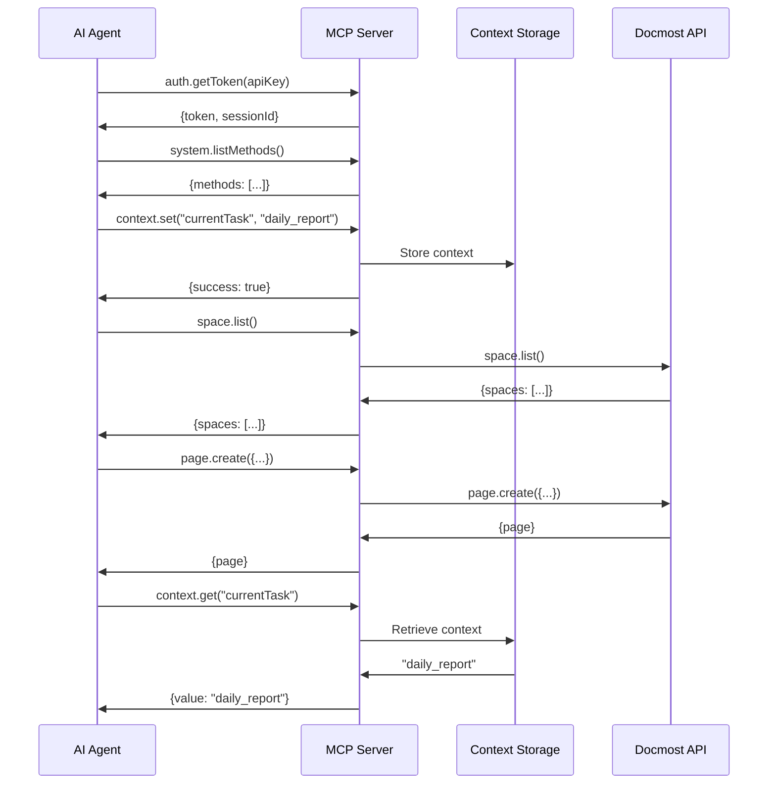

# Docmost MCP Server Development Plan

## Overview

This document outlines the plan to extend Docmost's existing Machine Control Protocol (MCP) into a Model Context Protocol server that enables AI agents to interact with Docmost's document management capabilities through a standardized, agent-friendly protocol.

## Current State

We have already implemented a robust foundation:

- **Complete JSON-RPC 2.0 API** with WebSocket communication
- **Comprehensive resource operations** (spaces, pages, comments, attachments)  
- **Real-time event system** with subscription capabilities
- **Authentication mechanisms** (API keys and JWT)

## Development Roadmap

### Phase 1: API Self-Description Layer (2-3 weeks)

1. **Tool Discovery**
   - Implement `system.listMethods` endpoint
   - Create comprehensive method documentation in JSON Schema format
   - Add example requests and responses
   - Document error codes with suggested resolutions

2. **Parameter Schemas**
   - Add formal parameter definitions for all methods
   - Implement validation against schemas
   - Create documentation for data structures
   - Add constraint descriptions and examples

### Phase 2: Context Management (2 weeks)

1. **Redis-Based Context Storage**
   - Implement Redis client integration
   - Create context namespacing for sessions
   - Add TTL support for expiring context
   - Build context retrieval and manipulation methods

2. **Session Management**
   - Add session tracking to authentication
   - Create session history recording
   - Implement session statistics
   - Build session cleanup mechanisms

### Phase 3: Agent Integration Support (3-4 weeks)

1. **SDK Development**
   - Create JavaScript/TypeScript SDK
   - Build Python SDK for agent frameworks
   - Develop example integrations for OpenAI and Anthropic
   - Create code snippets for common operations

2. **Documentation & Examples**
   - Create interactive API explorer
   - Build example agent implementations
   - Document integration patterns
   - Create tutorials for common use cases

## Technical Implementation Details

### Architecture

```
┌────────────────┐    ┌────────────────┐    ┌────────────────────┐
│                │    │                │    │                    │
│   AI Agents    │◄──►│   MCP Server   │◄──►│   Docmost API      │
│                │    │                │    │   (Machine Control │
└────────────────┘    └────────────────┘    │    Protocol)       │
                                            │                    │
                                            └────────────────────┘
```

### New System Methods

```javascript
// Tool discovery
system.listMethods() → Returns all available methods with documentation
system.getMethodSchema(methodName) → Returns detailed schema for a specific method

// Context management
context.set(key, value, ttl) → Stores a context value
context.get(key) → Retrieves a context value
context.delete(key) → Removes a context value
context.list() → Lists all context keys for the current session

// Session utilities
session.getHistory(limit, offset) → Returns operation history
session.getStats() → Returns usage statistics for current session
```

### Redis Context Storage Implementation

```typescript
// Context service implementation with Redis
import { createClient, RedisClientType } from 'redis';

export class ContextService {
  private redisClient: RedisClientType;
  
  constructor(redisUrl: string) {
    this.redisClient = createClient({ url: redisUrl });
    this.redisClient.connect();
  }
  
  // Store context with optional TTL
  async setContext(sessionId: string, key: string, value: any, ttlSeconds?: number): Promise<void> {
    const contextKey = `mcp:context:${sessionId}:${key}`;
    const serializedValue = JSON.stringify(value);
    
    if (ttlSeconds) {
      await this.redisClient.setEx(contextKey, ttlSeconds, serializedValue);
    } else {
      await this.redisClient.set(contextKey, serializedValue);
    }
  }
  
  // Retrieve context
  async getContext(sessionId: string, key: string): Promise<any> {
    const contextKey = `mcp:context:${sessionId}:${key}`;
    const value = await this.redisClient.get(contextKey);
    
    if (!value) return null;
    return JSON.parse(value);
  }
  
  // Delete context
  async deleteContext(sessionId: string, key: string): Promise<void> {
    const contextKey = `mcp:context:${sessionId}:${key}`;
    await this.redisClient.del(contextKey);
  }
  
  // Get all context keys for a session
  async listContextKeys(sessionId: string): Promise<string[]> {
    const pattern = `mcp:context:${sessionId}:*`;
    const keys = await this.redisClient.keys(pattern);
    
    // Strip the prefix to return just the user-facing keys
    return keys.map(k => k.replace(`mcp:context:${sessionId}:`, ''));
  }
  
  // Clear all context for a session (useful when session ends)
  async clearSessionContext(sessionId: string): Promise<void> {
    const pattern = `mcp:context:${sessionId}:*`;
    const keys = await this.redisClient.keys(pattern);
    
    if (keys.length > 0) {
      await this.redisClient.del(keys);
    }
  }
}
```

### Method Documentation Schema

```javascript
{
  "name": "page.create",
  "description": "Creates a new document page within a space",
  "category": "Document Management",
  "parameters": {
    "workspaceId": {
      "type": "string",
      "description": "UUID of the workspace",
      "required": true,
      "example": "01963588-32a9-7f89-879e-afb8fb600a5a"
    },
    "spaceId": {
      "type": "string",
      "description": "UUID of the space to create the page in",
      "required": true,
      "example": "01964729-c19e-7de3-b67d-71d4dc330b0f"
    },
    "title": {
      "type": "string",
      "description": "Title of the page",
      "required": true,
      "example": "Daily Team Review"
    },
    "content": {
      "type": "object",
      "description": "Page content in Docmost format",
      "required": true,
      "example": {
        "type": "doc",
        "content": [
          {
            "type": "paragraph",
            "content": [
              {
                "type": "text",
                "text": "Hello world"
              }
            ]
          }
        ]
      }
    }
  },
  "returns": {
    "id": {
      "type": "string",
      "description": "UUID of the created page"
    },
    "title": {
      "type": "string",
      "description": "Title of the created page"
    }
    // Other return fields
  },
  "errors": [
    {
      "code": "SPACE_NOT_FOUND",
      "message": "The specified space does not exist",
      "resolution": "Check the spaceId parameter or list available spaces"
    }
    // Other possible errors
  ],
  "examples": [
    {
      "description": "Create a simple page",
      "request": {
        // Example request
      },
      "response": {
        // Example response
      }
    }
  ],
  "relatedMethods": ["page.update", "page.get", "page.delete"]
}
```

### Redis Configuration

For Redis deployment with Docker, use the following configuration:

```yaml
version: '3'

services:
  mcp-server:
    build: .
    ports:
      - "3001:3001"
    environment:
      - REDIS_URL=redis://redis:6379
    depends_on:
      - redis

  redis:
    image: redis:7-alpine
    ports:
      - "6379:6379"
    volumes:
      - redis-data:/data
    command: redis-server --save 900 1 --loglevel warning --maxmemory 2gb --maxmemory-policy allkeys-lru

volumes:
  redis-data:
```

## Integration Patterns

### Example: Agent Interaction Flow



## Next Steps

1. **Immediate Actions**
   - Document all existing API methods in JSON Schema format
   - Set up Redis development environment
   - Create context service prototype

2. **Development Milestones**
   - Week 1-2: Implement system methods and schema documentation
   - Week 3-4: Build Redis context storage and session management
   - Week 5-7: Create SDKs and example agent integrations
   - Week 8: Final testing and documentation

3. **Future Enhancements**
   - Multi-agent collaboration utilities
   - Specialized AI agent templates
   - Performance analytics dashboard
   - Extended context management with vector storage 